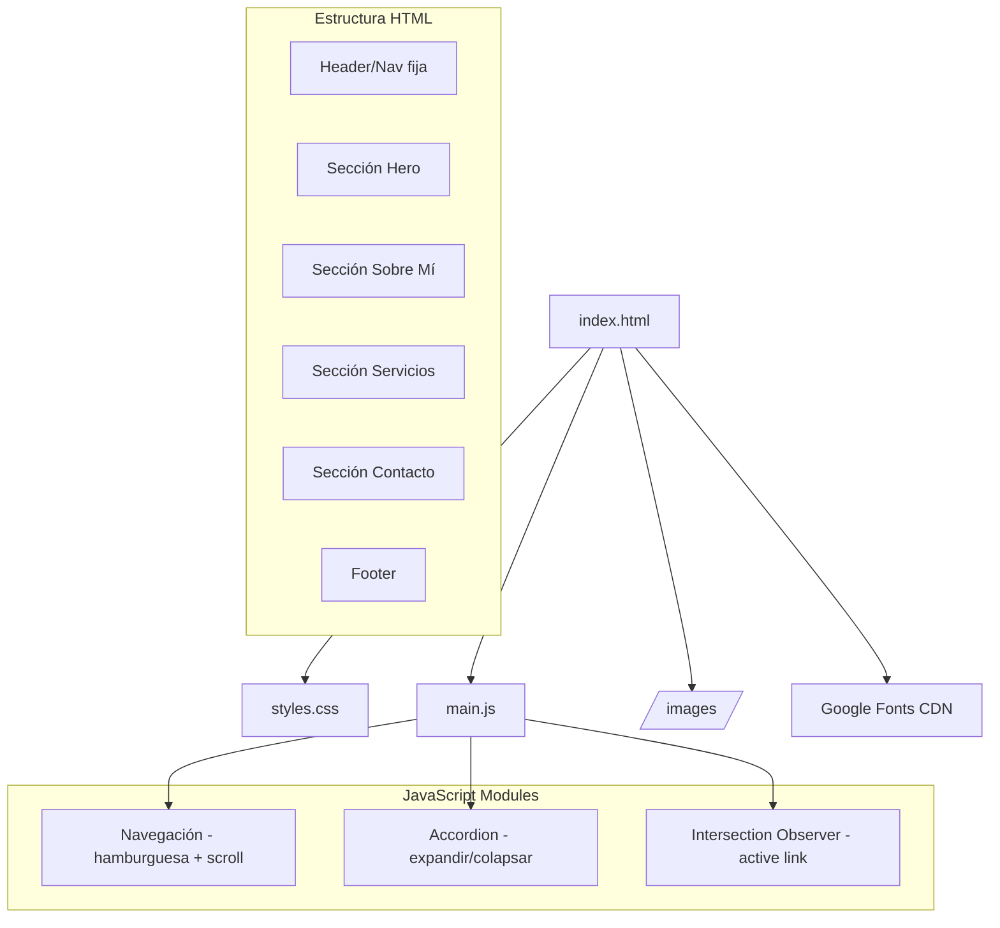

# Design Document

## Overview

Diseño técnico para el sitio web profesional de portafolio de Dobby's Vet — una médica veterinaria especializada en bienestar animal. El sitio es una página estática de tipo single-page que utiliza HTML5, CSS3 y JavaScript vanilla, optimizada para alojamiento gratuito en plataformas como Netlify o Cloudflare Pages.

### Decisiones de Diseño Clave

1. **Sin frameworks ni bundlers**: Se usa HTML/CSS/JS puro para máxima simplicidad, portabilidad y rendimiento. No hay dependencias de build.
2. **CSS custom properties**: Variables CSS para la paleta de colores y tipografía, facilitando mantenimiento y consistencia.
3. **Intersection Observer API**: Para el resaltado activo del menú de navegación según la sección visible, evitando listeners de scroll costosos.
4. **Mobile-first**: El diseño base es para móvil, con media queries progresivas para tablet (768px) y escritorio (1024px).
5. **Accesibilidad nativa**: Uso de atributos ARIA, navegación por teclado y semántica HTML5 correcta desde el diseño inicial.

## Architecture

El sitio sigue una arquitectura de página estática simple con separación de responsabilidades:



### Estructura de Archivos

```
/
├── index.html              # Documento principal single-page
├── styles.css              # Hoja de estilos principal
├── main.js                 # JavaScript para interactividad
├── images/                 # Imágenes optimizadas (WebP/JPEG)
│   ├── hero-bg.webp        # Imagen de fondo del hero
│   └── ...                 # Máximo 10 imágenes totales
├── ATTRIBUTIONS.md         # Atribuciones de imágenes y licencias
└── README.md               # Instrucciones de despliegue
```

## Components and Interfaces

### 1. Header / Navegación Fija

**Responsabilidad**: Menú de navegación sticky con links a cada sección y versión hamburguesa en móvil.

```html
<header class="nav-header" role="banner">
  <nav class="nav" role="navigation" aria-label="Navegación principal">
    <a href="#hero" class="nav__logo">Dobby's Vet</a>
    <button class="nav__toggle" aria-expanded="false" aria-controls="nav-menu" aria-label="Abrir menú">
      <span class="nav__hamburger"></span>
    </button>
    <ul id="nav-menu" class="nav__menu" role="menubar">
      <li><a href="#hero" class="nav__link nav__link--active" role="menuitem">Inicio</a></li>
      <li><a href="#about" class="nav__link" role="menuitem">Sobre Mí</a></li>
      <li><a href="#services" class="nav__link" role="menuitem">Servicios</a></li>
      <li><a href="#contact" class="nav__link" role="menuitem">Contacto</a></li>
    </ul>
  </nav>
</header>
```

**Comportamiento**:
- Posición `fixed` en la parte superior con `z-index` alto
- En viewport ≤ 768px: muestra botón hamburguesa, oculta menú
- Al clic en hamburguesa: expande menú con animación slide-down
- Al seleccionar enlace en móvil: colapsa el menú y hace scroll suave
- Navegable por teclado (Tab entre enlaces, Enter para activar)
- Intersection Observer actualiza clase `--active` según sección visible

### 2. Sección Hero

**Responsabilidad**: Presentación profesional con nombre, títulos, especialidad e imagen de fondo.

```html
<section id="hero" class="hero">
  <div class="hero__overlay">
    <div class="hero__content">
      <h1 class="hero__name">Dobby's Vet</h1>
      <p class="hero__title">Médica Veterinaria</p>
      <p class="hero__specialty">
        <span class="hero__badge">Especialista en Bienestar Animal</span>
      </p>
      <a href="#contact" class="hero__cta">Contáctame</a>
    </div>
  </div>
</section>
```

**Comportamiento**:
- Imagen de fondo con overlay semitransparente para legibilidad
- Hero ocupa 100vh en escritorio (≥1366x768) para ser visible sin scroll
- Botón CTA desplaza con smooth scroll a la sección contacto
- Jerarquía tipográfica: nombre > títulos > especialidad (badge diferenciador)

### 3. Sección Servicios (Accordion)

**Responsabilidad**: Lista de servicios veterinarios con componentes expandibles independientes.

```html
<section id="services" class="services">
  <h2 class="services__title">Servicios</h2>
  <div class="services__grid">
    <!-- Servicio veterinario -->
    <div class="service-card service-card--vet">
      <button class="service-card__header" 
              aria-expanded="false" 
              aria-controls="service-1-content"
              id="service-1-btn">
        <span class="service-card__icon" aria-hidden="true">🐾</span>
        <span class="service-card__name">Consulta Veterinaria General</span>
        <span class="service-card__chevron" aria-hidden="true"></span>
      </button>
      <div class="service-card__body" 
           id="service-1-content" 
           role="region" 
           aria-labelledby="service-1-btn"
           hidden>
        <p>Descripción detallada del servicio...</p>
      </div>
    </div>
    <!-- Otro servicio veterinario -->
    <div class="service-card service-card--vet">
      <button class="service-card__header" 
              aria-expanded="false" 
              aria-controls="service-2-content"
              id="service-2-btn">
        <span class="service-card__icon" aria-hidden="true">🐾</span>
        <span class="service-card__name">Medicina Preventiva</span>
        <span class="service-card__chevron" aria-hidden="true"></span>
      </button>
      <div class="service-card__body" 
           id="service-2-content" 
           role="region" 
           aria-labelledby="service-2-btn"
           hidden>
        <p>Descripción detallada del servicio...</p>
      </div>
    </div>
  </div>
</section>
```

**Comportamiento**:
- Todos los servicios colapsados por defecto (`hidden` + `aria-expanded="false"`)
- Clic en header: toggle expanded/collapsed con transición CSS ≤ 300ms
- Múltiples servicios pueden estar expandidos simultáneamente (accordion independiente)
- Todos los servicios usan acento verde (color primario) e ícono 🐾
- Operable por teclado: Enter/Espacio para toggle, Tab para navegar entre servicios

### 4. Sección Contacto

**Responsabilidad**: Mostrar información de contacto con enlaces funcionales e íconos.

```html
<section id="contact" class="contact">
  <h2 class="contact__title">Contacto</h2>
  <div class="contact__info">
    <a href="mailto:contacto@dobbysvet.com" class="contact__item">
      <span class="contact__icon" aria-hidden="true">✉️</span>
      <span>contacto@dobbysvet.com</span>
    </a>
    <a href="tel:+57XXXXXXXXXX" class="contact__item">
      <span class="contact__icon" aria-hidden="true">📞</span>
      <span>+57 XXX XXX XXXX</span>
    </a>
  </div>
  <div class="contact__social">
    <a href="#" class="contact__social-link" aria-label="Perfil de Instagram">
      <!-- SVG icon -->
    </a>
    <a href="#" class="contact__social-link" aria-label="Perfil de LinkedIn">
      <!-- SVG icon -->
    </a>
  </div>
</section>
```

**Comportamiento**:
- Email con `href="mailto:"` abre cliente de correo
- Teléfono con `href="tel:"` inicia llamada en móvil
- Redes sociales con `aria-label` descriptivo
- Ubicada como última sección antes del footer
- Texto mínimo 16px, íconos representativos

### 5. Módulo JavaScript: Navegación

```javascript
// Pseudo-interfaz del módulo de navegación
const Navigation = {
  init(),                    // Inicializa event listeners
  toggleMobileMenu(),        // Abre/cierra menú hamburguesa
  closeMobileMenu(),         // Cierra menú (tras selección)
  scrollToSection(sectionId), // Smooth scroll a sección
  updateActiveLink()         // Actualiza link activo via IntersectionObserver
};
```

### 6. Módulo JavaScript: Accordion

```javascript
// Pseudo-interfaz del módulo accordion
const Accordion = {
  init(),                       // Inicializa event listeners en service cards
  toggle(button),               // Expande/colapsa un servicio individual
  expand(button, content),      // Expande con animación
  collapse(button, content)     // Colapsa con animación
};
```

## Data Models

Al ser un sitio estático sin backend ni persistencia de datos, no hay modelos de datos en el sentido tradicional. Sin embargo, se define la estructura de contenido:

### Contenido de Servicios (hardcoded en HTML)

```javascript
// Estructura conceptual de un servicio
const ServiceItem = {
  id: "service-1",           // Identificador único
  category: "vet",           // Categoría: veterinario
  name: "string",            // Nombre del servicio
  description: "string",     // Descripción detallada
  icon: "🐾"                 // Emoji representativo
};
```

### Paleta de Colores (CSS Custom Properties)

```css
:root {
  --color-primary: #4CAF50;      /* Verde - veterinaria */
  --color-secondary: #64B5F6;    /* Azul suave - acento secundario */
  --color-white: #FFFFFF;
  --color-text: #333333;
  --color-bg-light: #F5F5F5;
  --color-overlay: rgba(0, 0, 0, 0.4);
  
  --font-family: 'Inter', sans-serif;
  --font-size-base: 16px;
  --font-size-h1: clamp(2rem, 5vw, 3.5rem);
  --font-size-h2: clamp(1.5rem, 3vw, 2.5rem);
  
  --transition-speed: 300ms;
  --nav-height: 64px;
  
  --breakpoint-tablet: 768px;
  --breakpoint-desktop: 1024px;
}
```

### Estructura de Atribuciones (ATTRIBUTIONS.md)

```markdown
# Atribuciones de Imágenes

| Archivo | Fuente | Autor | Licencia |
|---------|--------|-------|----------|
| hero-bg.webp | Unsplash | [Autor] | Unsplash License |
```

## Error Handling

Al ser un sitio estático con JavaScript mínimo, el manejo de errores se centra en degradación elegante:

### JavaScript

| Escenario | Estrategia |
|-----------|-----------|
| JavaScript deshabilitado | Los servicios quedan visibles (no usar `hidden` via JS en carga, sino aplicar `hidden` después de `DOMContentLoaded`) |
| Intersection Observer no soportado | Fallback: no se resalta enlace activo, navegación sigue funcional |
| Smooth scroll no soportado | Fallback nativo del navegador (salto directo) con `scroll-behavior: smooth` en CSS |
| Imagen no carga | Atributo `alt` descriptivo, color de fondo placeholder |

### CSS

| Escenario | Estrategia |
|-----------|-----------|
| Google Fonts no carga | Font stack con fallback: `'Inter', -apple-system, BlinkMacSystemFont, sans-serif` |
| WebP no soportado | Usar `<picture>` con fallback a JPEG |
| CSS custom properties no soportadas | Valores hardcoded como fallback en navegadores muy antiguos (opcional, soporte >95%) |

### Accesibilidad

| Escenario | Estrategia |
|-----------|-----------|
| Lector de pantalla | Atributos ARIA correctos, estructura semántica con landmarks |
| Solo teclado | Focus visible, tab order lógico, Enter/Espacio para interacciones |
| Modo alto contraste | Los colores principales cumplen ratio WCAG AA (4.5:1 para texto normal) |

## Testing Strategy

### ¿Por qué NO se usa Property-Based Testing?

Este proyecto es un sitio web estático con interacciones DOM simples (toggle classes, scroll). No contiene:
- Funciones puras con entradas/salidas variables
- Transformaciones de datos o parsers
- Lógica de negocio compleja
- Serialización/deserialización

Las pruebas apropiadas son de tipo ejemplo, integración visual, y accesibilidad.

### Estrategia de Testing

#### 1. Tests Manuales / Checklist de Verificación

| Verificación | Criterio |
|-------------|----------|
| Lighthouse Performance | Score ≥ 90, carga < 3s en 4G simulado |
| Lighthouse Accessibility | Score ≥ 95 |
| Responsive 768px | Layout reorganizado, menú hamburguesa visible |
| Responsive 1024px | Layout de escritorio completo |
| Hero sin scroll | Visible completo en 1366x768 |
| Accordion funcional | Expand/collapse con animación ≤ 300ms |
| Navegación teclado | Tab, Enter, Espacio funcionan correctamente |
| Links contacto | mailto: y tel: funcionales |
| Imágenes | Todas < 200KB, formato WebP/JPEG |
| Rutas relativas | Sitio funciona desde cualquier subdirectorio |

#### 2. Tests Automatizados (Ejemplo-Based)

Si se desea automatizar, usar un framework ligero como Playwright o Cypress para tests E2E:

- **Test: Navegación smooth scroll** — Clic en enlace del menú desplaza a la sección correcta
- **Test: Accordion expand/collapse** — Clic en servicio cambia `aria-expanded` y muestra contenido
- **Test: Accordion independiente** — Expandir un servicio no colapsa otros
- **Test: Menú hamburguesa** — En viewport ≤ 768px, botón toggle muestra/oculta menú
- **Test: Menú se cierra al seleccionar** — En móvil, seleccionar enlace cierra el menú
- **Test: CTA scroll** — Botón del hero desplaza a sección contacto
- **Test: Active link** — Al scroll, el enlace activo del menú se actualiza
- **Test: Accesibilidad teclado** — Tab navega entre servicios, Enter/Espacio toggle

#### 3. Validación Estática

- **HTML**: Validación W3C (sin errores)
- **CSS**: Sin errores de sintaxis, variables definidas
- **ARIA**: Validación con axe-core o pa11y
- **Imágenes**: Verificar tamaños < 200KB, atributos `alt` presentes
- **Performance**: Lighthouse CI integrado en deploy pipeline

#### 4. Tests de Compatibilidad

- Chrome, Firefox, Safari, Edge (últimas 2 versiones)
- iOS Safari, Chrome Android
- Verificar font loading, WebP support, smooth scroll
